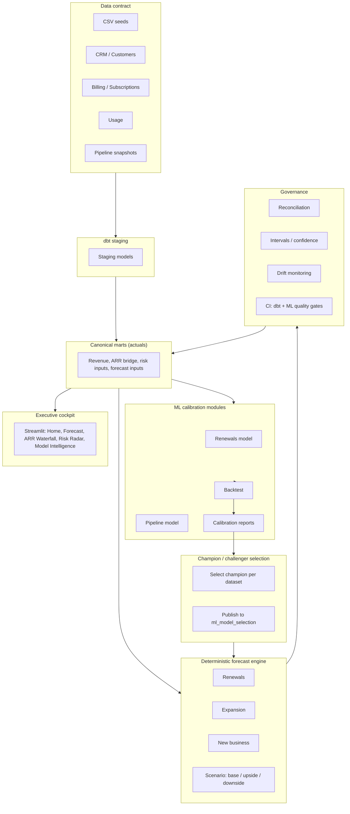

# Architecture overview

Staff- and founder-grade summary of how the Revenue Forecasting Platform works: problem, approach, and outputs.

---

## 1. System narrative

**Problem.** Revenue plans live in spreadsheets and CRM snapshots. There’s no single source of truth, no clear lineage, and no way to run what‑if scenarios (churn, expansion, pipeline conversion) that both finance and go‑to‑market can trust.

**Approach.** We treat forecasting as a **governed pipeline**: a clear data contract (CSV/CRM/billing/usage/pipeline) feeds dbt staging and canonical marts. A **deterministic forecast engine** (renewals, expansion, new business) produces baseline scenarios. **ML calibration modules** (renewals and pipeline) improve probabilities; **champion/challenger selection** picks the best model per domain. **Governance** (reconciliation, intervals, drift, CI) keeps outputs auditable. The **Executive Cockpit** (Streamlit) surfaces one-page snapshot, forecast vs actual, ARR waterfall, risk radar, and model intelligence.

**Outputs.** Executive summary, forecast vs actual with bands and scenarios, ARR waterfall with reconciliation, churn risk watchlist, top ARR movers, backtest and calibration metrics, and a single DuckDB warehouse that can run locally or in CI.

---

## 2. Architecture diagram

End-to-end flow from data contract to cockpit (GitHub-renderable Mermaid):

---

## 3. Design decisions

| Decision | Rationale |
|----------|-----------|
| **Deterministic baseline first** | Rules-based renewal and pipeline probabilities give an explainable, auditable forecast before any ML. Finance and RevOps can trust the logic; ML then improves accuracy without replacing the structure. |
| **ML as calibration modules** | Renewals and pipeline are separate ML modules that **calibrate** probabilities (and optionally replace rules). They plug into the same marts and forecast engine, so we can run rules-only, ML-only, or hybrid and compare. |
| **Scenario-first forecasting** | Base / upside / downside (and confidence intervals) are first-class. Decisions are scenario-based; the system doesn’t hide uncertainty. |
| **DuckDB portability** | Single file-based warehouse, no external DB for core runs. Fits local dev, demos, and CI; can be swapped or replicated for production. |

---

## See also

- [Demo script (3 min)](demo_script_3min.md)
- [Founder pitch one-pager](founder_pitch_onepager.md)
- [Company onboarding guide](company_onboarding_guide.md)
- [README](../README.md) — Quickstart and run instructions
